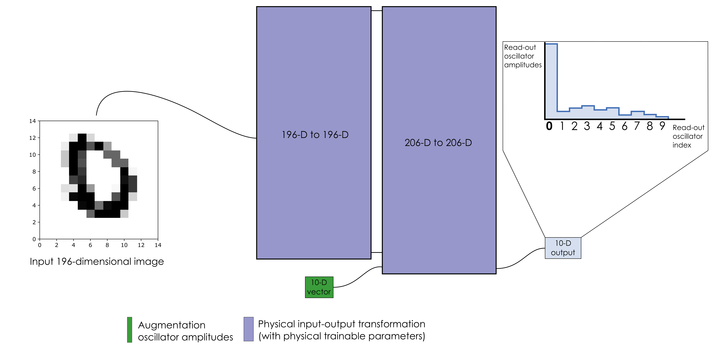
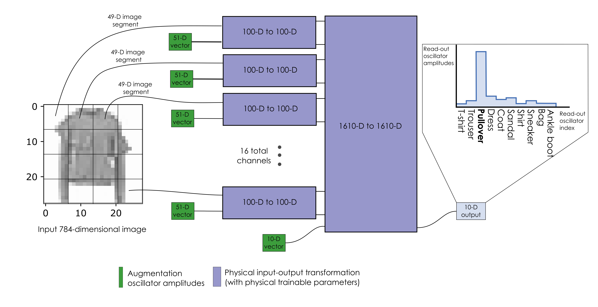

# Examples

- [Example 1: MNIST classification with PNNs](https://github.com/mcmahon-lab/Physics-Aware-Training/blob/main/Example%201%20MNIST%20classification%20with%20PNN.ipynb) 
In this notebook, we give an introduction to physical neural networks (PNNs) by showing how one can construct a two-layer PNN with coupled nonlinear oscillators to perform the MNIST task. 

- [Example 2 Fashion MNIST classification with PNN and PAT](https://github.com/mcmahon-lab/Physics-Aware-Training/blob/main/Example%202%20Fashion%20MNIST%20classification%20with%20PNN%20and%20PAT.ipynb)
In this notebook, we show how a physical neural network can be constructed out of coupled nonlinear oscillators to perform the Fashion MNIST task. We introduce a simulation-reality gap and show how to train the PNN with PAT.

- [Example 3: Toy example of a PAT autodifferentiable function](https://github.com/mcmahon-lab/physics-aware-training/blob/master/Example%203%20Toy%20example%20of%20a%20PAT%20autodifferentiable%20function.ipynb)
This notebook contains a simple implementation of PAT and demonstrates some of PAT's advantages over in silico training on a toy example. It is most interesting for users who want to see an implementation of PAT with as little coding overhead as possible.

[Back to the repository](https://github.com/mcmahon-lab/Physics-Aware-Training)
